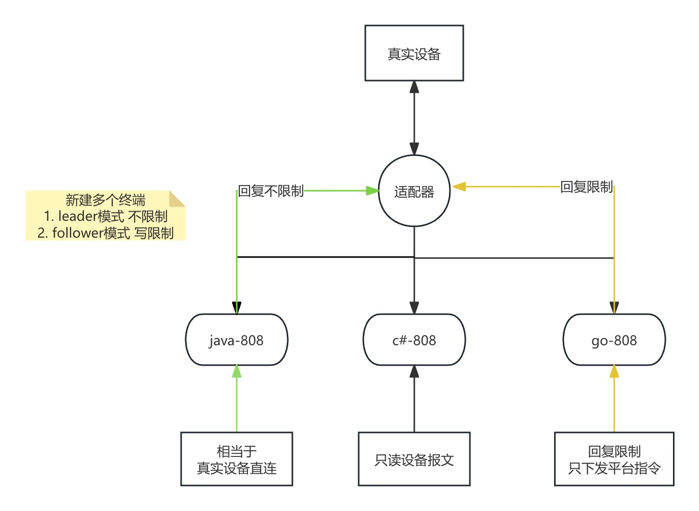

# 适配器

## 设计参考


1. 真实设备连接到适配器
2. 适配器向808服务发起多个连接
- leader模式 相当于真实设备直连
- follower模式 控制808服务下发到真实设备的指令
3. 真实设备断开则模拟连接全部断开 模拟连接断开则隔一段时间重试

## 使用案例
- [代码参考](../example/adapter/main.go)

``` go
func main() {
	address := "0.0.0.0:18080"
	adapterGroup := adapter.New(
		adapter.WithHostPorts(address),
		//adapter.WithAllowCommand( // 全局都允许的向设备写的命令
		//	consts.P9101RealTimeAudioVideoRequest,
		//),
		adapter.WithTimeoutRetry(10*time.Second), // 模拟连接断开后 多久重试一次
		adapter.WithTerminals(
			adapter.Terminal{
				Mode:       adapter.Leader,    // 服务和设备之间读写全部正常
				TargetAddr: "127.0.0.1:18081", // 其他项目的jt808服务
			},
			adapter.Terminal{
				Mode:       adapter.Follower,  // 服务读正常 写默认拒绝（只下发指定命令）
				TargetAddr: "127.0.0.1:18082", // go-jt808项目的jt808服务
				AllowCommands: []consts.JT808CommandType{
					consts.P9205QueryResourceList, // 允许向设备发送的命令
				},
			},
		),
	)
	adapterGroup.Run()
}

```

## 测试案例
1. 真实设备连接到适配器
2. leader关闭 follower正常的情况
- 此时真实设备不会收到默认回复
- 真实设备可收到允许的指令 如0x9205
3. leader的808服务开启
- 真实设备收到默认回复

``` txt
7e010200090000000010010002393837363534333231287e
7e8001000500000000100100000002010201957e
7e010000300000000010010001001f006e63643132337777772e3830382e636f6d0000000000000000003736353433323101b2e2413132333435363738697e
7e81000007000000001001000100010031303031977e
7e010200090000000010010002393837363534333231287e
7e8001000500000000100100020002010201977e
7e920500180000000010010003012412091636532412101636530000000000000000000000857e
7e1205002200000000100100000003000000010124110200000024110200010200000000000004000101010000000b2a7e
7e000200000000000010010003107e
7e000200000000000010010003107e
7e000200000000000010010003107e
7e000200000000000010010003107e
7e000200000000000010010003107e
7e8001000500000000100100000003000200947e
7e000200000000000010010003107e
7e8001000500000000100100010003000200957e
7e000200000000000010010003107e
7e8001000500000000100100020003000200967e
7e000200000000000010010003107e
7e8001000500000000100100030003000200977e

```
