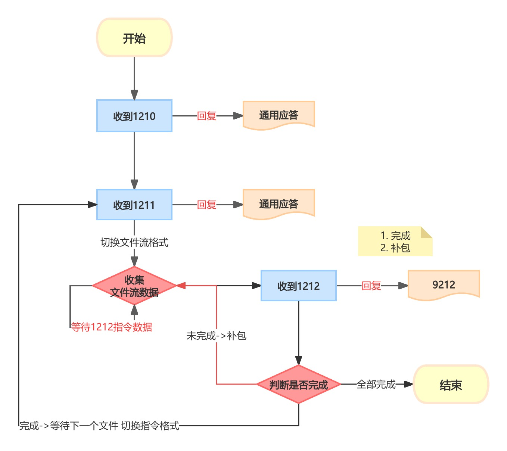

# 主动安全




- [代码参考](./local/main.go)

``` txt
1 启动主动安全附件服务
2 自定义模拟器把dir目录下的文件都上传

```

<h2 id="sb"> 苏标 </h2>

- [代码参考](./su_biao/main.go)

``` txt
1 设备连接到808服务
2 自定义终端事件 检测到苏标告警后发送9208指令
3 设备开始上传文件 本地./file.log中显示进度

```

<h2 id="ex"> 使用示例 </h2>

- [代码参考](./attach/main.go)

``` txt
1 修改配置文件 (实际只测试了苏标 其他标准有问题提issues)
2 设备上传成功后保存到本地 (可实现回调自定义保存 默认保存本地)
3 在设备上传的过程中触发http回调事件 包括开始 数据收集中 完成等事件
```