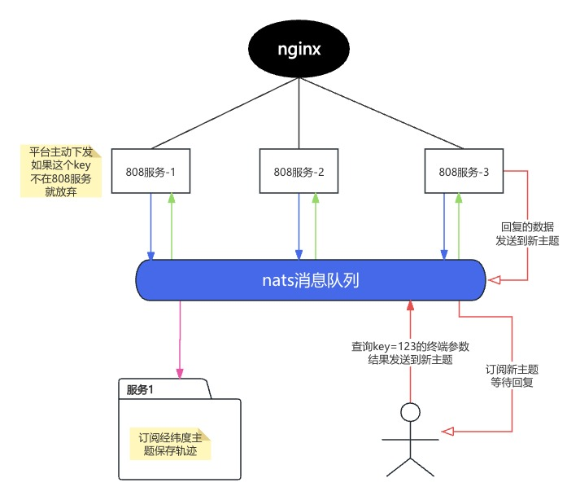

# 分布式集群



<h2 id="nginx"> nginx </h2>

- 使用nginx把终端分配到多台机器上
- 使用模拟器连接8080端口 自动分配到多个机器上
- 如果某台机器服务挂了 终端会重新连接 分配到可用机器上
``` nginx
stream {
    upstream backend_pool {
        server 127.0.0.1:808;
        server 192.168.1.10:808;
    }

    server {
        listen 8080;
        proxy_pass backend_pool;
    }
}
```

<h2 id="service"> 808服务 </h2>

分别在多台机器上 启动808服务
```
cd ./service
go build

./service -nats=127.0.0.1:4222 -id=1
./service -nats=192.168.1.66:4222 -id=2
```

<h2 id="alarm"> 业务服务 </h2>

订阅轨迹主题获取轨迹消息
```
cd ./alarm
go build

./alarm -nats=127.0.0.1:4222

```

```
保存经纬度 id[1] sim[14420000000] 数据体对象:{
        终端-位置上报:[00000000004c100301f637b307538233006401300002241209204320]
        [00000000] 报警标志:[0]
        [004c1003] 状态标志:[4984835]
        [01f637b3] 纬度:[32913331]
        [07538233] 经度:[122913331]
        [0064] 海拔高度:[100]
        [0130] 速度:[304]
        [0002] 方向:[2]
        [241209204320] 时间:[2024-12-09 20:43:20]
}
```

<h2 id="coordinator"> 指令协调器 </h2>

```
cd ./coordinator
go build
./coordinator -nats=127.0.0.1:4222
```

1. 根据加入事件和指令读取事件 判断在线
2. 根据退出事件判断离线 （可以加入超时机制 多久没读到指令也是离线）
3. 把下发的指令通知 广播给全部机器
- key存在这个机器上 发送指令给终端 把回复数据发送到新主题
- key不存在 则忽略掉
4. 收集整体处理情况 目前测试使用8103指令
5. 参考效果如下
```
curl http://127.0.0.1:12310/8103

发送通知sim [14420000000]
发送通知sim [14419999999]
收到回复 sim[14419999999] 数据体对象:{
        终端-通用应答:[0058810300]
        [0058] 应答流水号:[88]
        [8103] 应答消息ID:[33027]
        [00] 结果:[0] 0-成功 1-失败 2-消息有误 3-不支持 4-报警处理确认
}
收到回复 sim[14420000000] 数据体对象:{
        终端-通用应答:[0058810300]
        [0058] 应答流水号:[88]
        [8103] 应答消息ID:[33027]
        [00] 结果:[0] 0-成功 1-失败 2-消息有误 3-不支持 4-报警处理确认

```
