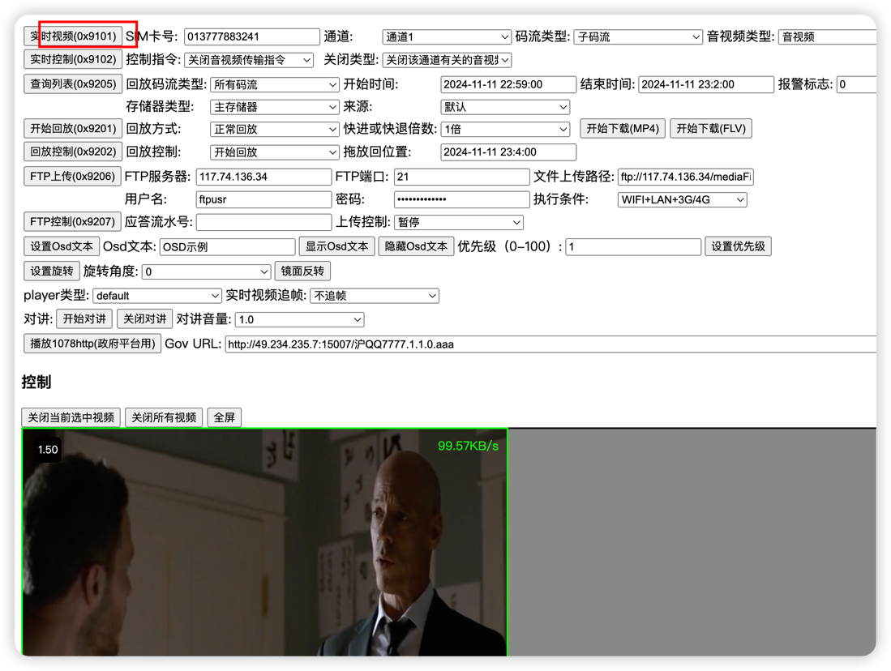

# JT1078流媒体

<h2 id="rtvs-dev"> RTVS终端模拟器 </h2>

```
rtvsdev（1078终端模拟器docker版本）
命令行运行
docker run --restart always -p 5288:80 -d vanjoge/rtvsdevice
然后访问你的//IP:5288即可

```

<h2 id="rtvs"> RTVS </h2>

- [RTVS官方地址](https://gitee.com/vanjoge/RTVS)
- [部署文档参考](https://blog.csdn.net/vanjoge/article/details/108319078)
- [代码参考](./rtvs/main.go)

address是设备连接的地址 webAddress是页面的
```  go
./rtvs -address 0.0.0.0:8082 -webAddress 0.0.0.0:17001
```

1. 测试部署网页 http://49.234.235.7:17001
2. 让终端(模拟器)默认连接到了49.234.235.7:8082地址
3. 根据测试部署网页进行测试 如点击9101观看在线视频

测试模拟器的手机号为 013777883241



需要对讲的话 则在本地打开tsrtvs.html测试

<h2 id="lal"> LAL流媒体服务 </h2>

1. 使用模拟器默认的数据 持续推送到LAL服务
2. 在线播放地址 http://49.234.235.7:8080/live/295696659617_1.flv
- [LAL官方文档](https://pengrl.com/lal/#/streamurllist)
- [代码参考](./lal/main.go)

<h2 id="sky-java"> JT1078 sky-java </h2>

1. 启动服务
2. 使用RTVS终端模拟器连接到服务
3. 调用sky-java的JT1078 HTTP接口发送请求(默认10秒内需要去拉流)
- [sky-java官方地址](https://gitee.com/hui_hui_zhou/open-source-repository)
- [sky-java HTTP文档](http://222.244.144.181:9991/doc.html)
- [代码参考](./sky/java/main.go)

<h2 id="m7s"> m7s-jt1078 </h2>

- [插件详情](https://github.com/cuteLittleDevil/m7s-jt1078)
- [代码参考](./m7s/main.go)