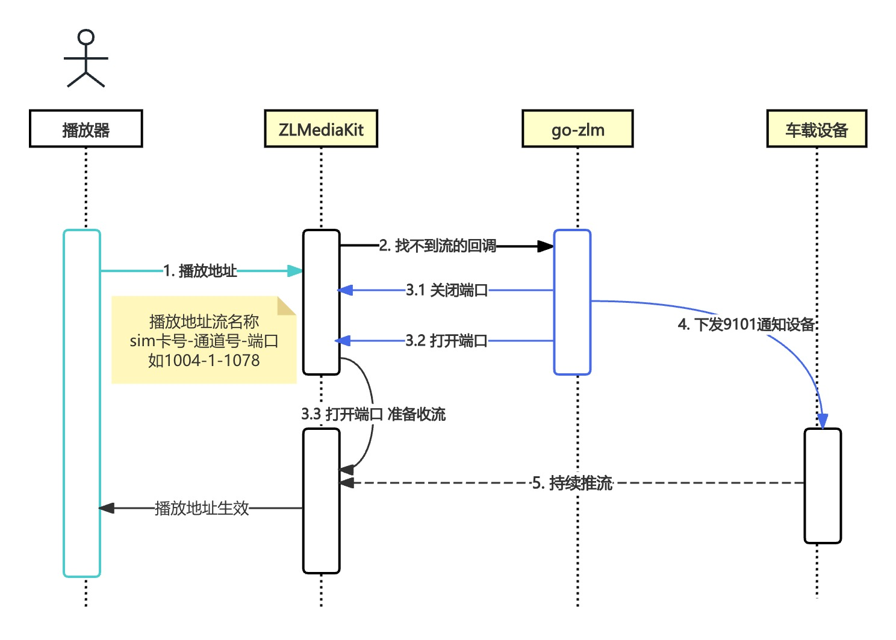

# JT1078流媒体

<h2 id="rtvs-dev"> RTVS终端模拟器 </h2>

```
rtvsdev（1078终端模拟器docker版本）
命令行运行
docker run --restart always -p 5288:80 -d vanjoge/rtvsdevice
然后访问你的//IP:5288即可

```
<br/>
<h2 id="rtvs"> RTVS </h2>

- [RTVS官方地址](https://gitee.com/vanjoge/RTVS)
- [部署文档参考](https://blog.csdn.net/vanjoge/article/details/108319078)
- [代码参考](./rtvs/main.go)
<br/>

address是设备连接的地址 webAddress是页面的
```  go
./rtvs -address 0.0.0.0:8082 -webAddress 0.0.0.0:17001
```
<br/>

1. 测试部署网页 http://49.234.235.7:17001
2. 让终端(模拟器)默认连接到了49.234.235.7:8082地址
3. 根据测试部署网页进行测试 如点击9101观看在线视频
<br/>

测试模拟器的手机号为 013777883241


需要对讲的话 则在本地打开tsrtvs.html测试
<br/>

<h2 id="lal"> LAL流媒体服务 </h2>

1. 使用模拟器默认的数据 持续推送到LAL服务
2. 在线播放地址 http://49.234.235.7:8080/live/1001_1.flv
<br/>

ip是外网的ip用于下发9101的1078的ip 可以用phone新建一个模拟终端 使用dataPath的数据推送1078流
```  go
./lal2 -ip=49.234.235.7
./lal2 -ip=49.234.235.7  -phone=1 -dataPath=./data.txt
```

<br/>

```
运行后 让设备连接到808端口 默认3秒发送9101
打印flv的播放地址（其他播放地址参考lal文档）
默认的播放地址格式 http://49.234.235.7:8080/live/手机号_通道号.flv
如 http://49.234.235.7:8080/live/156987000796_1.flv
```

- [LAL官方文档](https://pengrl.com/lal/#/streamurllist)
- [代码参考](./lal/main.go)
<br/>

<h2 id="sky-java"> JT1078 sky-java </h2>

1. 启动服务
2. 使用RTVS终端模拟器连接到服务
3. 调用sky-java的JT1078 HTTP接口发送请求(默认10秒内需要去拉流)
<br/>

- [sky-java官方地址](https://gitee.com/hui_hui_zhou/open-source-repository)
- [sky-java HTTP文档](http://222.244.144.181:9991/doc.html)
- [代码参考](./sky/java/main.go)
<br/>

<h2 id="m7s"> m7s-jt1078 </h2>

- [插件详情](https://github.com/cuteLittleDevil/m7s-jt1078)
- [代码参考](./m7s/main.go)
<br/>

<h2 id="zlm"> ZLMediaKit </h2>

- 目前1078只推荐单端口模式
- 使用ZLMediaKit试用版 [下载地址](https://github.com/ziyuexiachu/ci/actions/runs/13678145491/artifacts/2696568677)

<br/>

启动ZLMediaKit 复制secret
```
unzip LinuxTry_feature_1078_2025-03-05.zip -d /home/zlm
cd /home/zlm/linux/Release
# 可以把./example/jt1078/zlm_single_port/config.ini放到 /home/zlm/linux/Release目录 使用这个配置文件
./MediaServer
# 案例的secret是5xGbdUpfXnsiW3uZq2CApzSyxSFrIWpc
cat /home/zlm/linux/Release/config.ini | grep secret

```

<h3> 单端口模式 </h3>

- [代码参考](./zlm_single_port/main.go)

1. 启动go zlm单端口模式示例
```
cd ./example/jt1078/zlm_single_port
GOOS=linux GOARCH=amd64 go build
# config.yaml中的secret换成步骤2生成的secret
./zlm_single_port

```

2. 使用模拟器连接到808服务
- 测试案例的808服务默认端口是8083
如下所示 终端sim卡号1003的加入了
```
终端加入 key=[1003] command=[7e01020004000000001003000f31303033197e] err=[nil]

```
<br/>

3. 调用http接口发送9101请求
- ip换成部署的机器 案例云服务器ip 124.221.30.46 serverIPLen换ip的长度
``` curl
curl --location --request POST 'http://124.221.30.46:17002/api/v1/9101' \
--header 'Content-Type: application/json' \
--data-raw '{
    "key": "1003",
    "sim": "000000001003",
    "data": {
        "serverIPLen": 13,
        "serverIPAddr": "124.221.30.46",
        "tcpPort": 10000,
        "udpPort": 0,
        "channelNo": 1,
        "dataType": 0,
        "streamType": 0
    }
}'

```

- 返回结果如下
```
{
  "code": 200,
  "msg": "成功",
  "data": {
    "streamID": "000000001003_1_0_0",
    "mp4": "http://124.221.30.46:80/rtp/000000001003_1_0_0.live.mp4"
  }
}
```

4. 扩展
```
在config.ini的配置文件中添加
hook.enable=1
hook.on_stream_not_found=http://127.0.0.1:17002/api/v1/on_stream_not_found
on_publish=http://127.0.0.1:17002/api/v1/on_publish

用户访问http://124.221.30.46:80/rtp/000000001003_1_0_0.live.mp4
当流不存在的时候 触发on_stream_not_found 主动下发9101让这个流存在
因为zlm的流格式默认是sim卡号_通道号 触发on_publish 修改流id 格式变成 sim卡号_通道号_数据类型_主子码流
```

<h3> 添加对讲 </h3>

```
对讲使用webrtc 因此需要https
目前申请的域名go-jt808.online(ip为124.221.30.46) icp备案为三周左右

```


1. nginx代理
- 配置文件参考 /example/jt1078/zlm_single_port/nginx.conf

2. 访问测试页面


- 点击开始
- 发起http请求 绑定设备对讲流
``` curl
curl --location --request POST 'http://124.221.30.46:17002/api/v1/start_send_rtp_talk' \
--header 'Content-Type: application/json' \
--data-raw '{
      "key": "1003",
      "sim": "000000001003",
      "data": {
        "serverIPLen": 13,
        "serverIPAddr": "124.221.30.46",
        "tcpPort": 10000,
        "udpPort": 0,
        "channelNo": 1,
        "dataType": 2,
        "streamType": 0
      },
      "stream": "test"
}'

```

3. 重新发起一次808请求 让设备推送音视频流
- 如https://go-jt808.online/rtp/000000001003_1_0_0.live.mp4

<h3> 多端口模式 </h3>

- 目前不推荐使用 (2024.3.28询问过zlm作者)
- [代码参考](./zlm/main.go)



1. 启动go zlm的示例
```
cd ./example/jt1078/zlm
GOOS=linux GOARCH=amd64 go build -o go-zlm
# config.yaml中的secret换成步骤2生成的secret
# 这里把go-zlm和config.yaml放到了 /home/zlm/go/ 目录
./go-zlm

```
<br/>

2. 使用模拟器连接到808服务
- 测试案例的808服务默认端口是8083
如下所示 终端sim卡号1004的加入了
```
终端加入 key=[1004] command=[7e01020004000000001004002631303034307e] err=[nil]

```
<br/>

3. 调用http接口发送9101请求
- ip换成部署的机器 案例云服务器ip 124.221.30.46 serverIPLen换ip的长度
``` curl
curl --location --request POST 'http://124.221.30.46:17002/api/v1/9101' \
--header 'Content-Type: application/json' \
--data-raw '{
    "key": "1004",
    "data": {
        "serverIPLen": 13,
        "serverIPAddr": "124.221.30.46",
        "tcpPort": 1078,
        "udpPort": 0,
        "channelNo": 1,
        "dataType": 0,
        "streamType": 0
    }
}'

```

- 返回结果如下
```
{
  "code": 200,
  "msg": "成功",
  "data": {
    "streamID": "1004-1-1078",
    "mp4": "http://124.221.30.46:80/rtp/1004-1-1078.live.mp4"
  }
}
```

4. 扩展
```
在config.ini的配置文件中添加
hook.enable=1
hook.on_stream_not_found=http://127.0.0.1:17002/api/v1/on_stream_not_found

用户访问http://124.221.30.46:80/rtp/1004-1-1078.live.mp4
当流不存在的时候 主动下发9101让这个流存在
```