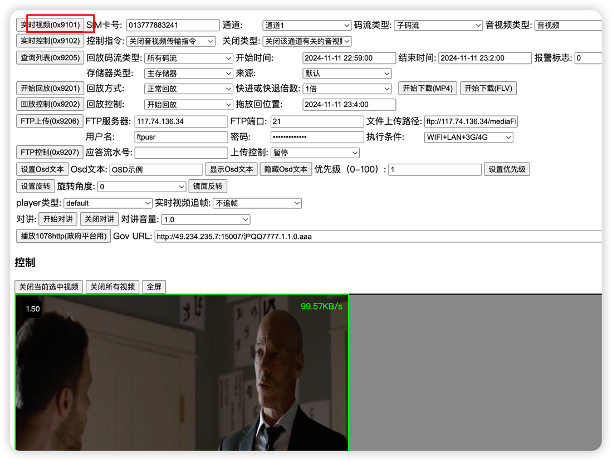
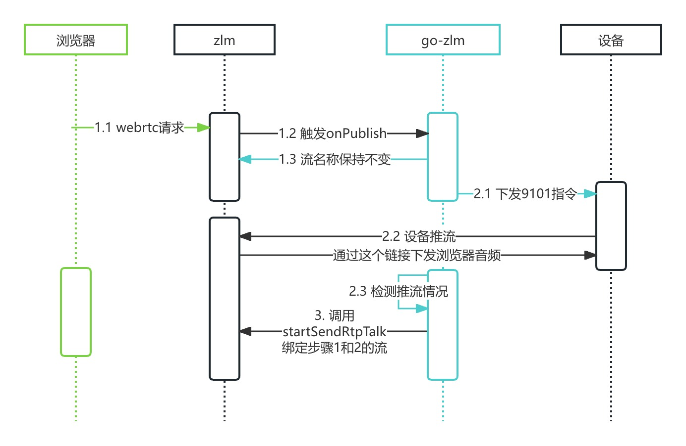
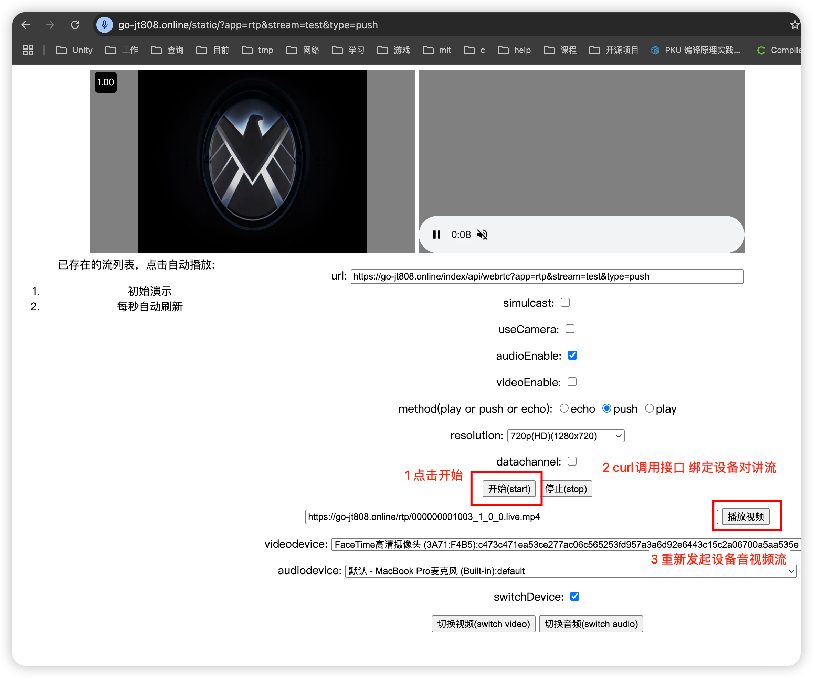
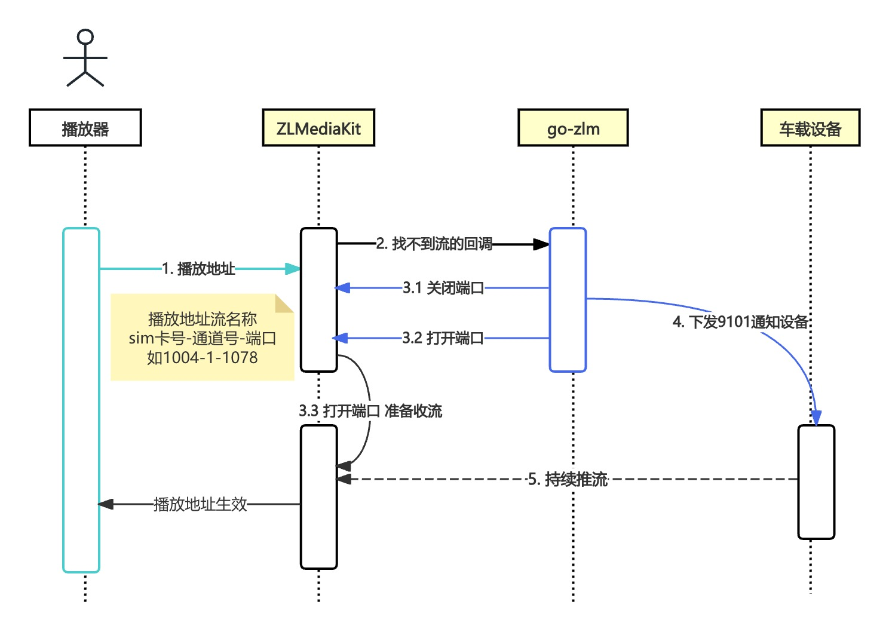

# JT1078 流媒体示例

本目录包含 JT1078 推流与播放的多种对接示例。

典型流程：
1. 平台下发 0x9101（实时音视频传输请求）
2. 终端开始推送音视频流
3. 流媒体侧提供 HTTP-FLV / MP4 / WebRTC 等播放方式

注意：本文档中的公网 IP 为作者测试环境，可能失效；建议替换为你的部署地址。

## 导航
- [RTVS-Dev（Docker）](#rtvs-devdocker)
- [1. RTVS](#1-rtvs)
- [2. LAL](#2-lal)
- [3. sky-java](#3-sky-java)
- [4. m7s-jt1078](#4-m7s-jt1078)
- [5. ZLMediaKit](#5-zlmediakit)
- [6. srs](#6-srs)

## RTVS-Dev（Docker）

rtvsdev（1078 终端模拟器 Docker 版本）

``` bash
docker run --restart always -p 5288:80 -d vanjoge/rtvsdevice
```

访问：
- http://<your-ip>:5288

## 1. RTVS

- RTVS 官方地址：https://gitee.com/vanjoge/RTVS
- 部署文档参考：https://blog.csdn.net/vanjoge/article/details/108319078
- 代码参考：[rtvs/main.go](./rtvs/main.go)

address 是设备连接地址，webAddress 是 RTVS Web 页面地址：

``` bash
./rtvs -address 0.0.0.0:8082 -webAddress 0.0.0.0:17001
```

在线测试（示例环境，可能失效）：
1. 打开测试部署网页 https://124.221.30.46:44300/index.html
2. 让终端（模拟器）连接到对应的 8082 地址
3. 在测试网页点击 9101 观看在线视频

测试模拟器手机号：013777883241



## 2. LAL

目标：
1. 使用模拟器默认数据持续推送到 LAL 服务
2. 从 LAL 获取播放地址（HTTP-FLV 等）

在线播放地址（示例环境，可能失效）：http://124.221.30.46:8080/live/1001_1.flv

参数说明：
- ip：公网 IP，用于下发 9101 时填写的 1078 服务地址
- phone：创建一个模拟终端
- dataPath：使用指定数据推送 1078 流

``` bash
./lal2 -ip=124.221.30.46
./lal2 -ip=124.221.30.46 -phone=1 -dataPath=./data.txt
```

运行后说明：
- 让设备连接到 808 端口，默认 3 秒发送一次 9101
- 打印 flv 播放地址（其他播放地址参考 LAL 文档）
- 默认播放地址格式：http://<ip>:8080/live/<手机号>_<通道号>.flv
- 示例：http://124.221.30.46:8080/live/156987000796_1.flv

- LAL 官方文档：https://pengrl.com/lal/#/streamurllist
- 代码参考：[lal/main.go](./lal/main.go)

## 3. sky-java

流程：
1. 启动 sky-java 服务
2. 使用 RTVS 终端模拟器连接到服务
3. 调用 sky-java 的 JT1078 HTTP 接口发送请求（默认 10 秒内需要拉流）

- sky-java 官方地址：https://gitee.com/hui_hui_zhou/open-source-repository
- sky-java HTTP 文档：http://222.244.144.181:9991/doc.html
- 代码参考：[sky/java/main.go](./sky/java/main.go)

## 4. m7s-jt1078

- 插件详情：https://github.com/cuteLittleDevil/m7s-jt1078

## 5. ZLMediaKit

- 目前 1078 推荐单端口模式
- ZLMediaKit 试用版下载：https://github.com/ziyuexiachu/ci/actions/runs/13678145491/artifacts/2696568677

启动 ZLMediaKit 并获取 secret：

``` bash
unzip LinuxTry_feature_1078_2025-03-05.zip -d /home/zlm
cd /home/zlm/linux/Release
./MediaServer
cat /home/zlm/linux/Release/config.ini | grep secret
```

### 单端口模式

- 代码参考：[zlm_single_port/main.go](./zlm_single_port/main.go)

1) 启动 go 单端口示例

``` bash
cd ./example/jt1078/zlm_single_port
GOOS=linux GOARCH=amd64 go build
./zlm_single_port
```

2) 使用模拟器连接到 808 服务
- 测试案例默认端口 8083
- 示例日志（sim=1003）：

``` txt
终端加入 key=[1003] command=[7e01020004000000001003000f31303033197e] err=[nil]
```

3) 调用 HTTP 接口发送 9101 请求
- 将 `<server-ip>` 替换为你的部署 IP
- serverIPLen 为 IP 字符串长度（例如 `124.221.30.46` 长度为 13）

``` curl
curl --location --request POST 'http://<server-ip>:17002/api/v1/9101' \
--header 'Content-Type: application/json' \
--data-raw '{
    "key": "1003",
    "sim": "000000001003",
    "data": {
        "serverIPLen": 13,
        "serverIPAddr": "<server-ip>",
        "tcpPort": 10000,
        "udpPort": 0,
        "channelNo": 1,
        "dataType": 0,
        "streamType": 0
    }
}'
```

返回示例：

``` json
{
  "code": 200,
  "msg": "成功",
  "data": {
    "streamID": "000000001003_1_0_0",
    "mp4": "http://<server-ip>:80/rtp/000000001003_1_0_0.live.mp4"
  }
}
```

4) 扩展（hook）

``` txt
hook.enable=1
hook.on_stream_not_found=http://127.0.0.1:17002/api/v1/on_stream_not_found
on_publish=http://127.0.0.1:17002/api/v1/on_publish
```

说明：
- 当用户访问 `http://<server-ip>:80/rtp/000000001003_1_0_0.live.mp4` 且流不存在时，触发 `on_stream_not_found`，主动下发 9101
- ZLM 默认流 ID 为 `sim卡号_通道号`，触发 `on_publish` 后可修改为 `sim卡号_通道号_数据类型_主子码流`

### 添加对讲（WebRTC）

对讲使用 WebRTC，因此需要 HTTPS。



1) nginx 代理
- 配置参考：[zlm_single_port/nginx.conf](./zlm_single_port/nginx.conf)

2) 访问测试页面



点击开始后发起 HTTP 请求，绑定设备对讲流：

``` curl
curl --location --request POST 'http://<server-ip>:17002/api/v1/start_send_rtp_talk' \
--header 'Content-Type: application/json' \
--data-raw '{
      "key": "1003",
      "sim": "000000001003",
      "data": {
        "serverIPLen": 13,
        "serverIPAddr": "<server-ip>",
        "tcpPort": 10000,
        "udpPort": 0,
        "channelNo": 1,
        "dataType": 2,
        "streamType": 0
      },
      "stream": "test"
}'
```

3) 重新发起一次 808 请求，让设备推送音视频流
- 示例：`https://<server-ip>/rtp/000000001003_1_0_0.live.mp4`

### 多端口模式

- 目前不推荐使用（2025-03-28 咨询过 ZLM 作者）
- 代码参考：[zlm/main.go](./zlm/main.go)



1) 启动 go zlm 示例

``` bash
cd ./example/jt1078/zlm
GOOS=linux GOARCH=amd64 go build -o go-zlm
./go-zlm
```

2) 使用模拟器连接到 808 服务
- 测试案例默认端口 8083
- 示例日志（sim=1004）：

``` txt
终端加入 key=[1004] command=[7e01020004000000001004002631303034307e] err=[nil]
```

3) 调用 HTTP 接口发送 9101 请求

``` curl
curl --location --request POST 'http://<server-ip>:17002/api/v1/9101' \
--header 'Content-Type: application/json' \
--data-raw '{
    "key": "1004",
    "data": {
        "serverIPLen": 13,
        "serverIPAddr": "<server-ip>",
        "tcpPort": 1078,
        "udpPort": 0,
        "channelNo": 1,
        "dataType": 0,
        "streamType": 0
    }
}'
```

返回示例：

``` json
{
  "code": 200,
  "msg": "成功",
  "data": {
    "streamID": "1004-1-1078",
    "mp4": "http://<server-ip>:80/rtp/1004-1-1078.live.mp4"
  }
}
```

4) 扩展（hook）

``` txt
hook.enable=1
hook.on_stream_not_found=http://127.0.0.1:17002/api/v1/on_stream_not_found
```

## 6. srs

- 部署 srs：https://github.com/ossrs/srs

``` bash
cd ./example/jt1078/srs
GOOS=linux GOARCH=amd64 go build
nohup ./srs-jt1078 &

cd ./example/jt1078/srs/jt808
GOOS=linux GOARCH=amd64 go build
nohup ./srs-jt808 &
```

可以在 srs 默认控制台页面查看当前播放的流：

``` txt
http://<srs-ip>:8080/console/ng_index.html#/streams?port=1985&schema=http&host=<srs-ip>
```
