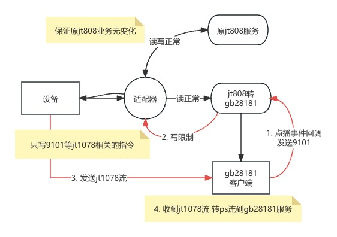
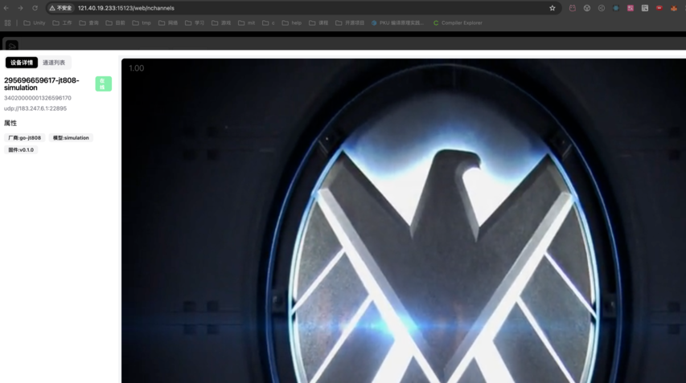
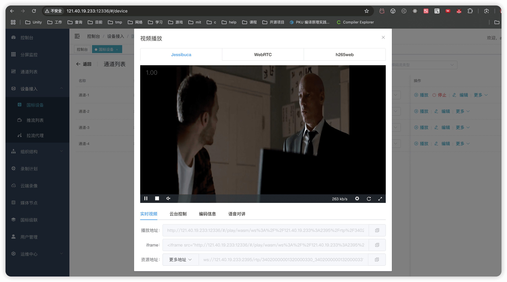

# jt808转gb28181



- 流程情况

```
原: jt808服务启动在808端口 设备连接到121.40.19.233:808

现: 808端口给适配器服务 设备连接到适配器 适配器产生2个jt808连接
一个连接到原jt808服务 (adapter.leader 默认127.0.0.1:20001) 保证原jt808服务业务正常
另一个连接到jt808转gb28181服务 (followers[0].address 默认127.0.0.1:20002)
只读写限制(只下发jt1078相关的指令) 不影响原jt808服务
```

<h2 id="m7s"> 1. m7s </h2>

- [m7s官网](https://monibuca.com/)
- admin.zip 加QQ下载(751639168) 或 https://download.m7s.live/bin/admin.zip
- 参考的配置文件的外网ip是121.40.19.233 需要修改成自己的

```
# 使用./testdata/m7s/config.yaml配置文件
# 配置文件和admin.zip(不用解压)放在m7s可执行文件同目录
./m7s

访问默认网页 选择国标设备->设备管理->通道详情->播放
http://127.0.0.1:12079/
```


<h2 id="gb28181"> 2. gb28181 </h2>

- 信令使用gb28181 https://github.com/gowvp/gb28181
- 流媒体使用zlm https://github.com/ZLMediaKit/ZLMediaKit
- 参考的配置文件的外网ip是121.40.19.233 需要修改成自己的

```
# 可以根据gb28181官方 打包docker使用
# 这里使用直接编译的gb28181和下载好的zlm

# zlm下载 https://github.com/ZLMediaKit/ZLMediaKit/issues/483
# 使用的配置文件 ./testdata/gb28181/config.ini 放到和MediaServer同级的目录
./MediaServer -c config.ini

# 使用Makefile文件上的构建linux应用 可执行文件为bin
# 前端使用github上的下载链接 https://github.com/gowvp/gb28181_web/releases
# 下载www.zip 解压放到和bin同级的目录
# 配置文件 ./testdata/gb28181/config.toml 放到./configs/config.toml
./bin

默认首页 左侧国标通道 -> 选择任意一个通道点击
http://121.40.19.233:15123
```


<h2 id="wvp"> 3. wvp </h2>

- 信令使用wvp https://github.com/648540858/wvp-GB28181-pro
- 流媒体使用zlm https://github.com/ZLMediaKit/ZLMediaKit
- 参考的配置文件的外网ip是121.40.19.233 需要修改成自己的

```
# 可以根据gb28181官方 打包docker使用
# 这里使用直接编译的gb28181和下载好的zlm

# zlm下载 https://github.com/ZLMediaKit/ZLMediaKit/issues/483
# 使用的配置文件 ./testdata/wvp/config.ini 放到和MediaServer同级的目录
./MediaServer -c config.ini

# 使用wvp打包的 https://github.com/648540858/wvp-GB28181-pro/releases/
# 配置文件 ./testdata/wvp/wvp.yaml 放到同级目录下
# redis和mysql配置好后
java -jar wvp-pro-*.jar --spring.config.location=./wvp.yaml

默认账号密码都是: admin
默认首页 左侧设备接入 -> 国标设备 -> 选择任意一个设备通道点击播放
http://121.40.19.233:12336
```


<h2 id="config"> 配置文件说明 </h2>


```
docker pull cdcddcdc/jt808-to-gb28181:latest
```

```
docker run -d \
-v /home/config.yaml:/app/jt808_to_gb28181/config.yaml \
--network host \
cdcddcdc/jt808-to-gb28181:latest
```

``` yaml
adapter:
  enable: true # 是否启用
  address: "0.0.0.0:808" # 设备连到适配器地址
  retrySecond: 30 # 模拟链接断开后 多久重试一次 单位秒
  leader: "127.0.0.1:20001" # 服务和设备之间读写全部正常
  followers:
    - address: "127.0.0.1:20002" # 服务和设备之间读正常 写默认拒绝(只允许部分命令)
      # 允许的命令 jt1078相关的
      allowCommands: [0x9101, 0x9102, 0x9003, 0x9201, 0x9202, 0x9205, 0x9206, 0x9208]

jt808:
  apiAddress: "0.0.0.0:20000" # gin http
  address: "0.0.0.0:20002" # 808服务
  hasDetails: false # 报文是否显示详情解析
  jt1078:
    ip: "127.0.0.1" # 让设备发送到这个ip 通常是外网ip
    # 收流端口规则 默认是gb28181收流端口-100
    # 如gb28181收流端口是10100 则jt1078收流端口是10000
    portRule: -100
    # 收到点播事件的回调 是收到国标bye的时候去关闭这个链接
    onPlayURL: "http://127.0.0.1:20000/api/v1/jt808/9101"

  gb28181:
    # 信令默认使用UDP 也可以TCP
    # 流只支持tcp被动 即模拟设备主动去连接平台
    transport: "UDP"
    keepAliveSecond: 30 # 设备保活周期 默认30秒
    platform:
      domain: "34020000002" # 平台域
      id: "34020000002000000001" # 平台ID
      password: "123456" # 平台密码
      ip: "127.0.0.1" # 平台IP 部署机器的模拟gb28181链接过去的 通常使用内网ip
      port: 15060 # 平台端口
    device: # http回调获取设备ID 默认规则是 3402000000132 + sim卡号最后6位 + 0
      onConfigURL: "http://127.0.0.1:20000/api/v1/jt808/gb28181/device"

simulator:
  #模拟设备连自己 模拟一个设备 发送注册 鉴权 循环3次发送经纬度 默认1个小时后退出
  enable: true # 是否启用
  address: "127.0.0.1:808"
  sim: "295696659617" # 模拟设备SIM卡号
  leaveSecond: 3600 # 模拟设备多久退出 默认3600秒 小于0则不退出
  # "../testdata/data.txt" jt1078的h264文件
  # "../testdata/audio_data.txt" jt1078的h264+g711a文件
  filePath: "./testdata/audio_data.txt" # 模拟jt1078数据的文件 点播的话重复这个文件数据的10次

```