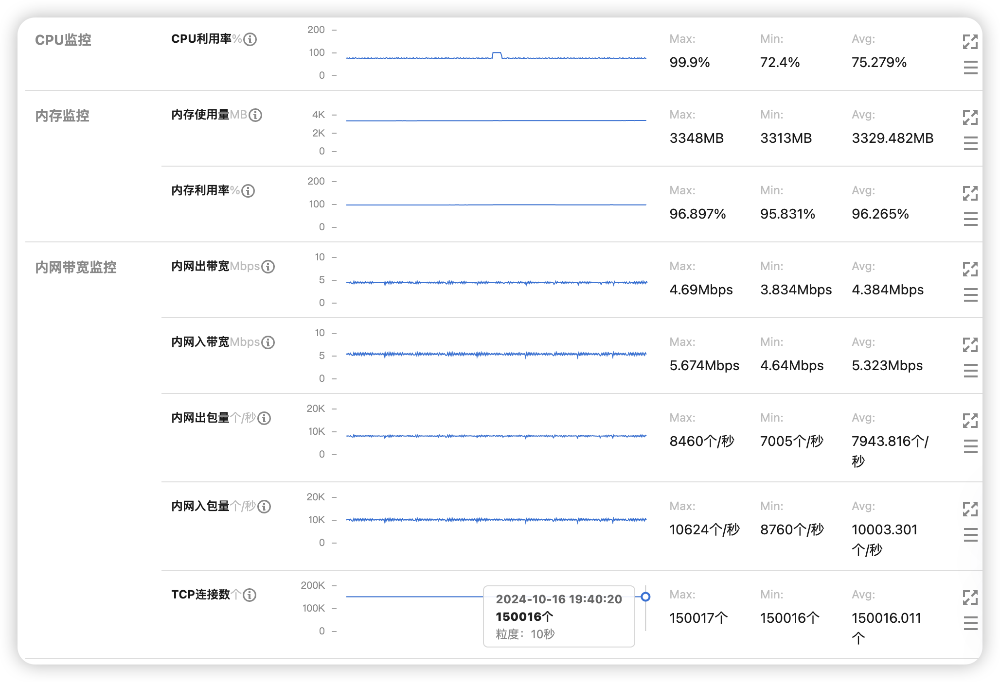
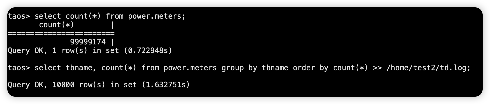
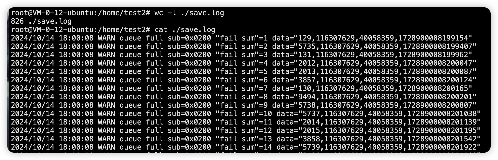

# 性能测试

mac系统的参数 临时修改
``` shell
# 增大统默认的最大连接数限制
sudo sysctl -w kern.maxfiles=8880000
# 增大单个进程默认最大连接数限制
sudo sysctl -w kern.maxfilesperproc=8990000
# 设置当前shell能打开的最大文件数
ulimit -n 1100000
# 设置当前shell可以创建的最大用户线程数
ulimit -u 26600
# 调整可用端口数量
sysctl -w net.inet.ip.portrange.first=5000
```

linux系统的 永久修改
``` shell
vi /etc/sysctl.conf
# 服务器系统级参数 最大打开文件数
fs.file-max=1100000
# 服务器进程级参数 最大打开文件数
fs.nr_open=1100000
# 增加进程可用端口
net.ipv4.ip_local_port_range = 5000 65000

vi /etc/security/limits.conf
# 限制用户进程最大打开文件数量限制 soft(软限制) hard(硬限制)
*  soft  nofile  1000000
*  hard  nofile  1010000

# 生效
sysctl -p
# 查看
sysctl -a
```

---
<h2 id="online"> 1. 连接数测试 </h2>

- 模拟器请求为1次注册 1次鉴权 循环发送心跳(20秒间隔)
- 使用2台云服务器[2核4G] 因为一个ip有效端口是65535个 测试10w+需要2个ip

### 1.1 操作
服务端
``` shell
cd ../quick_start && go build
nohup ./start >./start.log &
```

模拟器
``` shell
cd ./client && go build
# A服务器的模拟器
nohup ./client -ip=127.0.0.1 -max=50005 -blc=0 -lc=0 >./test1.log &
# B服务器的模拟器
nohup ./client -ip=10.0.16.14 -addr=10.0.16.5:8080 -max=50005 -blc=0 -lc=0 >./test2.log  &
```

### 1.2 测试结果
| 服务端版本  |   场景   | 并发数 |  服务器配置  | 服务器使用资源情况 |  描述  |
| :---:   | :-------: | :--: | :------: | :-------------- | :----------------------------: |
|  v0.3.0 | 连接数测试  | 10w+ |  2核4G | 120%+cpu 1.7G内存  | 10.0.16.5上开启服务端和模拟器  <br/> 10.0.16.14机器上开启模拟器 |

在本机启动的 腾讯云统计*2 显示150017 实际100012


<h2 id="save"> 2. 模拟经纬度存储测试 </h2>

- 模拟器请求为1次注册 1次鉴权 循环发送心跳、位置上报
- 默认间隔时间分别为20秒 5秒
- 消息队列使用nats 数据库使用tdengine测试

### 2.1 依赖的服务nats和tdengine
| 描述                | 链接                         |
|--------------------|------------------------------|
| nats    | https://github.com/nats-io/nats-server |
| 使用安装包快速体验 TDengine | https://docs.taosdata.com/get-started/package/ |

### 2.2 操作

模拟存储经纬度 从nats获取保存到tdengine
``` shell
cd ./save && GOOS=linux GOARCH=amd64 go build
# 接收数据 每一个终端一张表 表名称为(T+手机号)
./save -nats=127.0.0.1:4222 -dsn='root:taosdata@ws(127.0.0.1:6041)/information_schema' >./save.log
```

服务端 把经纬度相关报文发送到nats
``` shell
cd ./server && GOOS=linux GOARCH=amd64 go build
./server -nats=127.0.0.1:4222 >./server.log
```

模拟器 模拟设备发生经纬度
``` shell
cd ./client && GOOS=linux GOARCH=amd64 go build
# 至多打开1w个客户端 每一个客户端发送1w个0x0200经纬度消息 1亿经纬度 (为了方便统计 不发送0x0704)
./client -ip=127.0.0.1 -blc=0 -limit=10000 -max=10000 -lc=2 >./client.log
```

统计资源消耗情况
``` shell
# 隔1800秒 保存一次运行情况
sudo atop -w ./atop.log 1800
# 观察各服务的资源情况
# t-前进 T-后退 m-内存 g-cpu c-详情
atop -r ./atop.log
```

### 2.3 测试结果
``` sql
# 安装tdengine的机器上 输入taos 进入命令行
select count(*) from power.meters;
# 查看各个模拟终端保存数据的情况
select tbname, count(*) from power.meters group by tbname order by count(*) >> /home/test2/td.log;
```


1w个客户端 每一个客户端发送100个0x0200
| 发送数量 | 成功率 | 频率 | 描述 |
| :---: | :-----: | :------: | :------: |
| 100w |  98.5%+ | 每秒1w | 测试三次分别为985430 985299 989668 |
| 100w |  100% | 每秒5000 | 测试三次分别为100w 100w 100w |

| 服务端版本  |   场景   | 客户端 |  服务器配置  | 服务使用资源情况 |  描述  |
| :---:   | :-------: | :--: | :------: | :-------------- | :----------------------------: |
|  v0.3.0 | 模拟实际场景  | 1w |  2核4G | 35%cpu 180.4MB内存 | 每秒5000 一共保存经纬度1亿  <br/> 实际保存99999174 成功率99.999% |

- 数据丢失原因 save进程channel队列溢出  <br/>


各服务的资源使用情况
- [atop采样详情](./testdata/atop.log)
- [atop 使用的cpu](./testdata/atop_cpu.png)
- [atop 使用的内存](./testdata/atop_cpu.png)

| 服务  |   cpu   | 内存 | 描述 |
| :---:   | :-------: | :--: | :--: |
|  server | 35% | 180.4MB | 808服务端 |
|  client | 23% | 196MB | 模拟客户端 |
|  save |  18% | 68.8MB | 存储数据服务 |
|  nats-server | 20% | 14.8MB | 消息队列 |
|  taosadapter | 37% | 124.3MB | tdengine数据库适配 |
|  taosd | 15% | 124.7MB | tdengine数据库 |