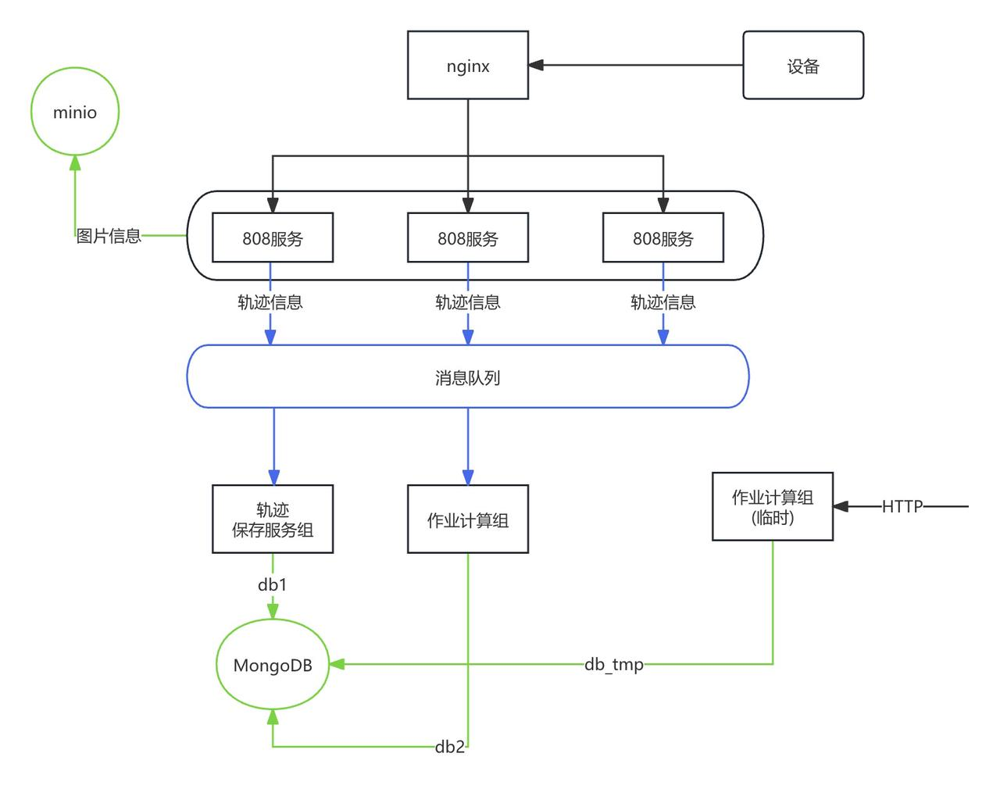

# web


- [apifox文档](https://vsh9jdgg5d.apifox.cn) [离线导入](./testdata/JT808协议.apifox.json)
- nats参考 https://github.com/nats-io/nats-server/releases
- jt1078流媒体参考 https://github.com/cuteLittleDevil/go-jt808/tree/main/example/jt1078#-rtvs-

```
./nats-service
```

| 服务  |   默认IP   | 默认端口 | 描述 |
| :---:   | :-------: | :--: | :--: |
|  nats | 0.0.0.0 | 4222 | 消息队列 |
|  service | 0.0.0.0 <br/> 0.0.0.0 | 18000 <br/> 808 | web服务 <br> 808服务端 |
|  attach | 0.0.0.0 | 18001 | 附件服务 |
|  alarm | 0.0.0.0 | 18002 | 处理轨迹报文 |
|  notice | 0.0.0.0 | 18003 | 订阅车辆报文交互 |

运行
```
cd ./service && go build && ./service
cd ./attach && go build && ./attach
cd ./alarm && go build && ./alarm
cd ./notice && go build && ./notice -address=0.0.0.0:18003 -nats=127.0.0.1:4222
```

## 中农云设备对接情况



### 服务情况
| 服务  |   默认IP   | 默认端口 | 描述 |
| :---:   | :-------: | :--: | :--: |
|  nats | 0.0.0.0 | 4222 | 消息队列 |
|  minio | 101.32.2.3 | 9000 | 保存定时图片上传 |
|  mongodb | 101.32.2.3 | 17017 | 需要版本大于5.0 使用时序类集合 |
|  service | 0.0.0.0 <br/> 0.0.0.0 | 18000 <br/> 808 | web服务 <br> 808服务端 |
|  alarm | 0.0.0.0 | 18002 | 处理轨迹报文 |


### 中农云对接设备问题

- 校验码错误
```
因为报文里面含有7d01错误了 -> 已解决
```

- 设备注册不符合预期
```
预期流程
1. 注册 -> 校验
2. 校验 -> 校验失败 -> 重新注册

实际流程
1. 注册 -> 校验
2. 校验 -> 校验失败 -> 校验
目前已修改为预期流程
```

- 设备定时图片字段错误

```
目前定时任务的事件项编码是0 正确为1
0-平台下发指令 1-定时动作
临时修改 在./alarm/camera.go中 可以去掉定时判断
```

``` go
func (c *Camera) OnReadExecutionEvent(msg *service.Message) {
	if err := c.Parse(msg.JTMessage); err == nil {
		const timing = 1
		if c.T0x0801.EventItemEncode == timing { // 这个判断去了就可以保存了
			phone := msg.Header.TerminalPhoneNo
			now := time.Now().Format("150405")
			name := fmt.Sprintf("%s_%s_%d", now, phone, c.MultimediaID)
			go c.SaveData(name, msg.Key, phone)
		}
	}
}
```