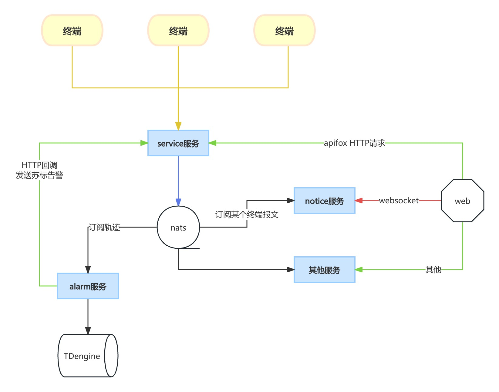

# web



- [apifox文档](https://vsh9jdgg5d.apifox.cn) [离线导入](./testdata/JT808协议.apifox.json)
- nats参考 https://github.com/nats-io/nats-server/releases
- jt1078流媒体参考 https://github.com/cuteLittleDevil/go-jt808/tree/main/example/jt1078#-rtvs-

```
./nats-service
```

| 服务  |   默认IP   | 默认端口 | 描述 |
| :---:   | :-------: | :--: | :--: |
|  nats | 0.0.0.0 | 4222 | 消息队列 |
|  service | 0.0.0.0 <br/> 0.0.0.0 | 18000 <br/> 808 | web服务 <br> 808服务端 |
|  attach | 0.0.0.0 | 18001 | 附件服务 |
|  alarm | 0.0.0.0 | 18002 | 处理轨迹报文 |
|  notice | 0.0.0.0 | 18003 | 订阅车辆报文交互 |

运行
```
cd ./service && go build && ./service
cd ./attach && go build && ./attach
cd ./alarm && go build && ./alarm
cd ./notice && go build && ./notice -address=0.0.0.0:18003 -nats=127.0.0.1:4222
```

